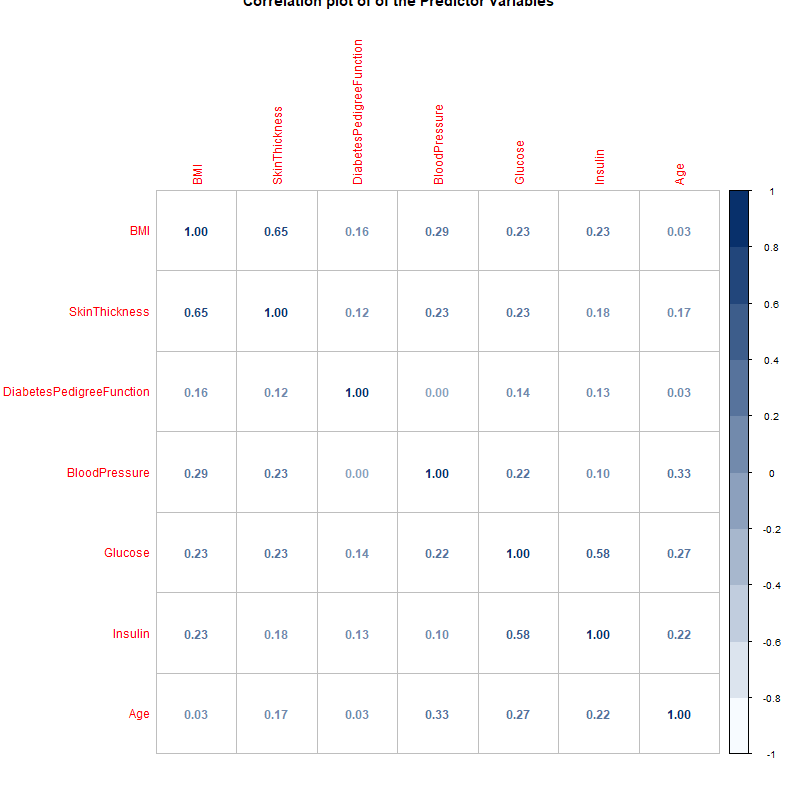

# 🧪 Pima Indians Diabetes Risk Factor Analysis
This project explores clinical variables associated with the prevalence of diabetes among Pima Indian women using statistical analysis and visualization techniques in R.

---

## 📌 Project Overview
This analysis was originally completed as part of my MSc in Data Science at Nottingham Trent University. Using real-world clinical data, I applied hypothesis testing, correlation analysis, and logistic regression to identify significant predictors of diabetes.

---

## 📁 Project Structure
pima-diabetes-risk-analysis/
│
├── data/
│   └── diabetes.csv              ← Source dataset
│
├── scripts/
│   └── pima_analysis.R           ← Main R Scripts with all analysis
│
├── report/
│   └── final_report.pdf          ← Full report from Msc
│
├── README.md                     ← You're reading it!

## 📊 Dataset Description
- **Population:** 768 women of Pima Indian heritage (age ≥ 21)
- **Target variable:** `Outcome` (1 = diabetes, 0 = non-diabetic)
- **Predictors include:**
  - Glucose
  - Blood Pressure
  - Skin Thickness
  - Insulin
  - BMI
  - Diabetes Pedigree Function
  - Age

> [Dataset](data/diabetes.csv)
---

## 🔍 Key Questions Explored
1. How should we treat missing values?
2. What are the statistical distributions of clinical variables?
3. Which predictors significantly differ between diabetic and non-diabetic individuals?
4. What variables are most associated with diabetes outcomes?
5. Can we predict missing Glucose values using Age?

---

## 🛠 Methods & Techniques
- Data Cleaning & Preprocessing
- Summary Statistics
- Visualizations: Histograms, Boxplots, Barplots, Correlation Plots
- Normality Testing: Kolmogorov-Smirnov
- Hypothesis Testing: T-test, Wilcoxon Rank-Sum
- Correlation: Pearson & Spearman
- Logistic Regression (with stepwise AIC)
- Linear Regression for Imputation

---

## 📈 Visual Samples

| Boxplots by Outcome | Correlation Matrix |
|---------------------|--------------------|
|  |  |

---

## 🧠 Key Findings
- **Significant predictors** of diabetes: `Glucose`, `BMI`, `Age`, and `Diabetes Pedigree Function`
- Positive correlation between:
  - `Skin Thickness ↔ BMI`
  - `Glucose ↔ Insulin`
- Logistic regression offered accurate prediction of diabetes status with interpretable odds ratios

---

## 📘 Report
- Full academic write-up in (report/final_report.pdf)
- Includes methodology, statistical test results, model summaries, and conclusions

---

## 👩🏾‍💻 Author

**Agnes Etim Ekpo**  
MSc Data Science | Data Scientist | agnesekpo.com  
📫 [LinkedIn](https://www.linkedin.com/in/theaekpo) | [GitHub](https://github.com/TheAEkpo)

---

## 📄 License

MIT License – feel free to use, share, and improve!
